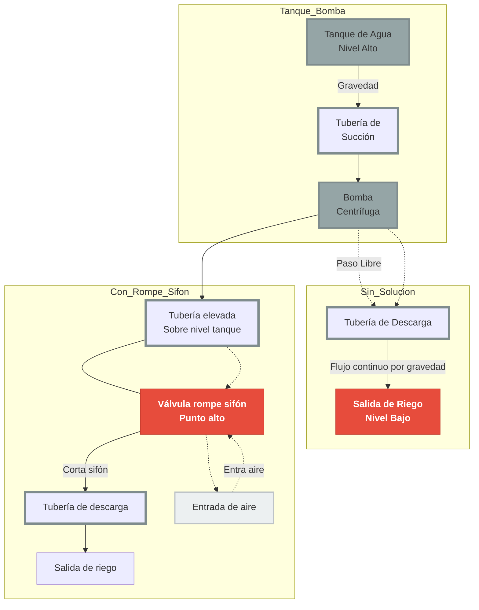

```mermaid
graph TD
    classDef water fill:#3498db,stroke:#2980b9,stroke-width:2px,color:white;
    classDef air fill:#ecf0f1,stroke:#bdc3c7,stroke-width:2px;
    classDef tank fill:#95a5a6,stroke:#7f8c8d,stroke-width:3px;
    classDef pipe stroke:#7f8c8d,stroke-width:4px;
    classDef important fill:#e74c3c,stroke:#c0392b,color:white,font-weight:bold;

    subgraph Tanque_Bomba
        Tanque["Tanque de Agua\nNivel Alto"]:::tank
        Bomba["Bomba\nCentrífuga"]:::tank
        Succion["Tubería de\nSucción"]:::pipe
        
        Tanque -->|Gravedad| Succion
        Succion --> Bomba
    end

    subgraph Sin_Solucion
        Descarga_A["Tubería de Descarga"]:::pipe
        Salida_A["Salida de Riego\nNivel Bajo"]
        
        Bomba -.->|Paso Libre| Descarga_A
        Descarga_A -->|Flujo continuo por gravedad| Salida_A:::important
    end

    subgraph Con_Rompe_Sifon
        Tuberia_Elevada["Tubería elevada\nSobre nivel tanque"]:::pipe
        Valvula_Vacio["Válvula rompe sifón\nPunto alto"]:::important
        Descarga_B["Tubería de descarga"]:::pipe
        Salida_B["Salida de riego"]
        Aire["Entrada de aire"]:::air
        
        Bomba --> Tuberia_Elevada
        Tuberia_Elevada --- Valvula_Vacio
        Valvula_Vacio -->|Corta sifón| Descarga_B
        Descarga_B --> Salida_B
        
        Aire -.->|Entra aire| Valvula_Vacio
    end

    Bomba -.-> Descarga_A
    Tuberia_Elevada -.-> Valvula_Vacio
    Valvula_Vacio -.-> Aire
```